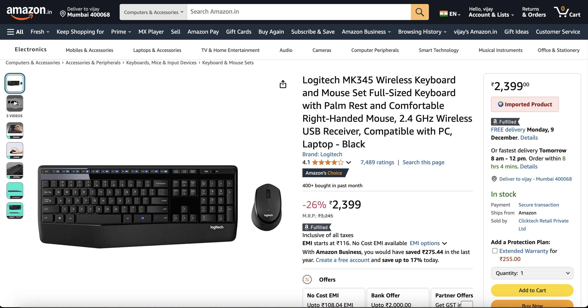
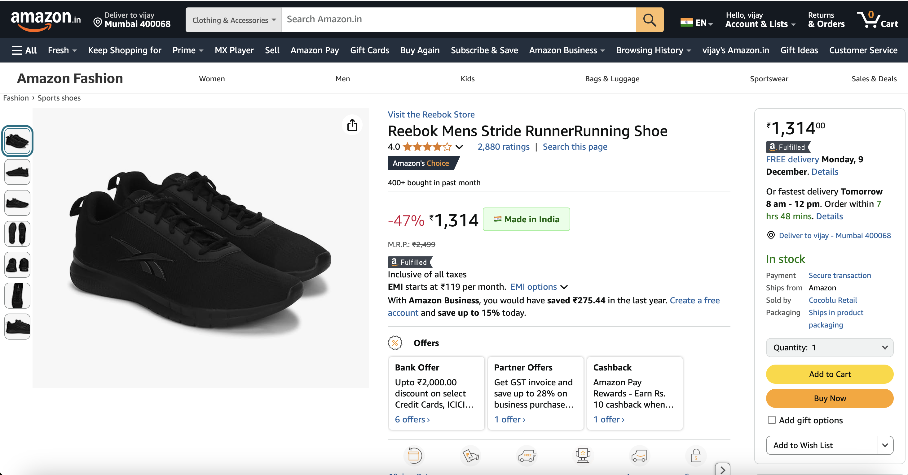

# Amazon Origin Tracker

Amazon Origin Tracker is a browser extension that helps users determine the country of origin of products on Amazon. It provides a simple and intuitive way to identify where products are made, directly from the product page on Amazon.

---

## Features

- Detects the country of origin for Amazon products.
- Supports **amazon.com** and **amazon.in** domains.
- Easy-to-use interface activated via the extension icon.
- Lightweight and straightforward to install and use.

---

## Installation

To run the extension locally on your machine:

1. Clone the repository:
   ```bash
   git clone https://github.com/Vsjangal/AmazonOriginTracker.git
   cd AmazonOriginTracker
2. Open Chrome and navigate to chrome://extensions/.
3. Enable Developer mode (toggle switch in the top-right corner).
4. Click on Load unpacked and select the extension folder of this project.
5. Once loaded, click on the extension icon in the toolbar to activate the extension.

## Screenshots

Here are some sample Screenshot demonstrating the action of extension:

- **Screenshot 1**: Showing the detected country of origin for a product.  
  

- **Screenshot 2**: Extension interface after activation.  
  

  - **Screenshot 3**: Extension interface after activation.  
  

## Usage

1. After installation, navigate to a product page on **Amazon.com** or **Amazon.in**.
2. Click on the extension icon in the toolbar.
3. The extension will display the country of origin for the selected product (if available).

## Contributing

Contributions are welcome. Feel free to submit issues or pull requests.

1. Fork the repository.
2. Create a new branch: `git checkout -b feature-branch-name`
3. Make your changes and commit them: `git commit -m 'Description of changes'`
4. Push the changes to your fork: `git push origin feature-branch-name`
5. Submit a pull request.

---

Enjoy using Amazon Origin Tracker! 😊
